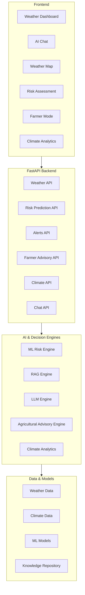

# WeatherGPT — AI-Powered Weather Decision Support

> **Smart India Hackathon 2026 • Problem Statement: SIH26068**

WeatherGPT is an AI-powered weather decision-support platform that converts weather and climate data into simple, actionable information for citizens, farmers, and disaster-preparedness use cases.

## Features

* 🌦️ Real-time weather and forecast information
* 🤖 Conversational AI weather assistant
* ⚠️ Weather risk assessment
* 🌾 Farmer Mode with crop-specific advisories
* 📊 Historical climate and cyclone analytics
* 🗺️ Interactive weather and geographic visualization
* 📚 Retrieval-Augmented Generation (RAG) using trusted domain sources
* 🌐 Multilingual conversational support
* 🎙️ Browser-based voice interaction
* 📈 Machine-learning-based weather impact prediction

## Technology Stack

* **Frontend:** React 19, Vite, Tailwind CSS
* **Backend:** FastAPI, Python
* **Machine Learning:** Scikit-learn
* **Data Processing:** Pandas, NumPy
* **Visualization:** Recharts, Leaflet
* **Weather Data:** Open-Meteo
* **Scientific Data:** IMD, ISRO/NRSC and other publicly available datasets
* **AI/RAG:** LLM-based reasoning and semantic retrieval
* **Testing:** Pytest

## System Architecture



## Data Sources

WeatherGPT uses publicly available weather, rainfall, climate, and disaster-related datasets for analysis and demonstration.

| Data Source                  | Purpose                                     |
| ---------------------------- | ------------------------------------------- |
| Open-Meteo                   | Current weather and forecasts               |
| IMD datasets                 | Rainfall and climate information            |
| ISRO/NRSC datasets           | Hydrological and rainfall analysis          |
| Historical cyclone records   | Long-term disaster and climate analysis     |
| Synthetic demonstration data | ML experimentation and prototype evaluation |

> **Note:** Dataset availability, coverage, preprocessing, and model performance may change as the project evolves. Refer to the project source code and dataset documentation for implementation details.

## Machine Learning

The project includes machine-learning models for estimating weather-related impact and risk.

The current prototype uses:

* `HistGradientBoostingClassifier`
* `RandomForestRegressor`
* Time-aware train/test evaluation
* Feature engineering from rainfall, temperature, wind, pressure, and soil-moisture-related variables

Example features include:

* Precipitation
* Wind gust
* Surface pressure
* Recent rainfall
* Cumulative rainfall
* Soil-moisture-related indicators

Model performance should be interpreted as **prototype evaluation results**, not as a guarantee of real-world forecasting accuracy.

## Farmer Mode

Farmer Mode converts weather information into crop-specific recommendations.

Supported example crops include:

* Wheat
* Rice
* Maize
* Cotton
* Sugarcane
* Pulses

The system can consider:

* Crop
* Crop growth stage
* Expected rainfall
* Temperature
* Wind conditions
* Recent weather conditions

Example recommendations include irrigation planning, spraying precautions, and weather suitability for agricultural activities.

> Agricultural recommendations are for informational and demonstration purposes. Farmers should verify important decisions with local agricultural experts and official advisories.

## RAG Knowledge Engine

The RAG component retrieves information from a curated knowledge repository containing domain-relevant material from authoritative sources.

It is designed to provide grounded responses rather than relying only on general-purpose LLM knowledge.

## Project Structure

```text
WeatherGPT/
│
├── backend/
│   ├── main.py
│   └── requirements.txt
│
├── frontend/
│   ├── src/
│   ├── package.json
│   └── ...
│
├── data/
│   ├── raw/
│   ├── processed/
│   └── synthetic/
│
├── ml/
│   └── train.py
│
├── src/
│   └── data/
│
├── rag/
│   └── documents/
│
├── tests/
│
├── .gitignore
└── README.md
```

## Installation

### Prerequisites

* Python 3.10+
* Node.js 18+
* npm
* Git

### 1. Clone the Repository

```bash
git clone https://github.com/Raj-singh73/WeatherGPT.git
cd WeatherGPT
```

### 2. Backend Setup

Install Python dependencies:

```bash
pip install -r backend/requirements.txt
```

Run data-processing scripts if required:

```bash
python src/data/inspect_datasets.py
python src/data/merge_datasets.py
python src/data/generate_synthetic_data.py
```

Train the ML models:

```bash
python ml/train.py
```

Run the tests:

```bash
pytest tests/ -v
```

### 3. Start the Backend

```bash
python backend/main.py
```

The FastAPI server will run locally.

API documentation is available through the FastAPI Swagger interface at:

```text
http://localhost:8000/docs
```

### 4. Start the Frontend

Open another terminal:

```bash
cd frontend
npm install
npm run dev
```

The Vite development server will provide the local frontend address in the terminal.

## Demo Scenarios

### 1. Citizen Weather Query

A user can select a location and ask questions such as:

> "Will heavy rain affect me tomorrow?"

The system combines forecast information, feature engineering, risk estimation, and AI-generated explanations to provide an understandable response.

### 2. Agricultural Decision Support

A farmer can select:

* Location
* Crop
* Crop growth stage

The system analyzes weather conditions and provides an agricultural advisory based on the selected context.

### 3. Climate Analytics

Users can explore historical climate and cyclone information through interactive visualizations to understand long-term patterns and disaster-related trends.

## Testing

The project includes automated tests covering core data-processing, machine-learning, and API functionality.

Run:

```bash
pytest tests/ -v
```

## Security

Do **not** commit API keys, passwords, access tokens, or other credentials to the repository.

Store sensitive configuration in environment variables, for example:

```text
.env
```

Make sure `.env` is included in `.gitignore`.

Example:

```gitignore
.env
*.key
*.pem
__pycache__/
node_modules/
```

## Disclaimer

WeatherGPT is a **prototype decision-support system developed for Smart India Hackathon 2026**.

Its predictions and recommendations should not be treated as official weather warnings, emergency instructions, or guaranteed forecasts.

For emergency or life-critical decisions, always verify information with official authorities such as the **India Meteorological Department (IMD)** and relevant disaster-management authorities.

## License

This project is developed as part of the **Smart India Hackathon 2026**.

Add an appropriate open-source license if you intend to make the repository publicly reusable.
